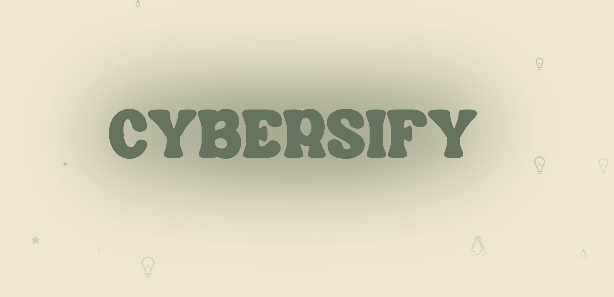

# CYBERSIFY 
Cybersifyph is an online educational organization whose goal is to spread internet literacy among the youth with educational posts and projects. Cybersifyph teaches kids about topics that aren't usually taught at in school, such as: penetration testing, IP addresses, security vulnerability, and much more. Our only goal is to increase the number of students interested in taking a technology based career, and get kids excited about the wonderful world of tech.

<p align="center">
  <br>
  
  <br>
</p>
<p align="center" >
  <a href="#features">Features</a> •
  <a href="#Files">Files</a> •
  <a href="#how-to-use">How To Use</a> •
  <a href="#packages">Packages</a>   
</p>
<p align="center" >
<a href="https://https://cybersifyph.netlify.app//">Try it out here</a> 
</p>

## Features

* Vite
```bash
# Install dependencies
$ npm i
# run the app
$ npm run dev
```

## Files

- src: the file that implements de solution.
- assets: resources that are used in an application.
- components: reusable pieces of code that define the appearance and behavior of a part of the UI.
- pages: the different areas of the portfolio.
- constants: values that cannot be altered by the program during normal execution.


## How To Use

To clone and run this application, you'll need [Git](https://git-scm.com), [Node.js](https://nodejs.org/en) and [Vite](https://vitejs.dev/) installed on your computer. From your command line:

```bash
# Clone this repository
$ git clone https://github.com/bl33h/whosbl33h

# Install dependencies
$ npm i

# Run the app
$ npm run dev
```

## Packages

This software uses the following open source packages:

- [Vite](https://vitejs.dev/)
- [React](https://reactjs.org/)
- [Tailwind](https://tailwindcss.com/)
